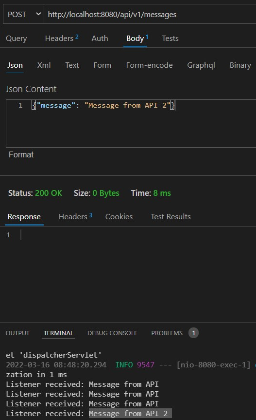

# Intro

Kafka Tutorial: how to get Kafka up and running, configure **Topics, Producers and Consumer**. 

Spring Boot is used to build a Restful API that will integrate with Kafka eco system.

* https://kafka.apache.org/quickstart
* https://www.youtube.com/watch?v=SqVfCyfCJqw


# Getting Started

### Start

```
# kafka folder
 bin/zookeeper-server-start.sh config/zookeeper.properties
 bin/kafka-server-start.sh config/server.properties

# app folder
./mvnw spring-boot:run


```
### Test

